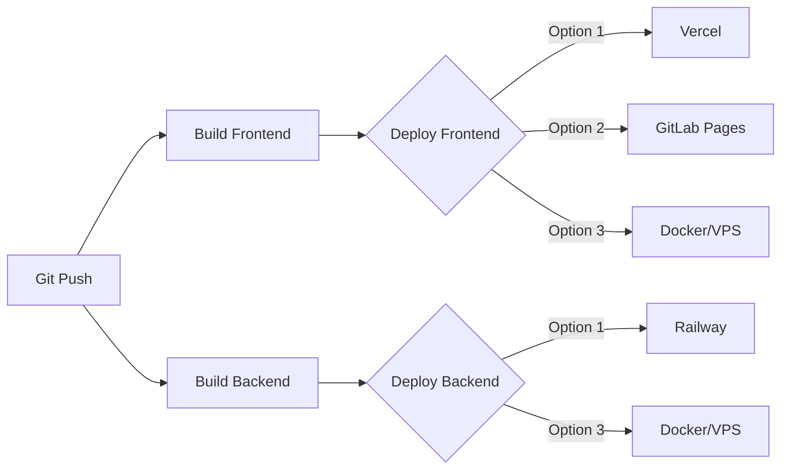

# 🚀 GitLab CI/CD Setup Guide

This guide helps you set up automated deployments using GitLab CI/CD.

---

## 📋 Current Configuration

Your pipeline is configured with **Option 1: Vercel + Railway** (recommended)

- ✅ **Frontend** → Vercel
- ✅ **Backend** → Railway
- 🔄 **Auto-deployment on push to `main`** (currently manual, can be automated)

---

## 🛠️ Step 1: Set Up GitLab CI/CD Variables

Go to your GitLab project: **Settings → CI/CD → Variables**

Click **"Add variable"** and add the following:

### For Vercel Deployment (Frontend)

| Key | Value | Protected | Masked |
|-----|-------|-----------|--------|
| `VERCEL_TOKEN` | Your Vercel token | ✅ | ✅ |

**How to get VERCEL_TOKEN:**
1. Go to [vercel.com/account/tokens](https://vercel.com/account/tokens)
2. Click "Create Token"
3. Name it "GitLab CI/CD"
4. Copy the token
5. Paste it in GitLab CI/CD Variables

### For Railway Deployment (Backend)

| Key | Value | Protected | Masked |
|-----|-------|-----------|--------|
| `RAILWAY_TOKEN` | Your Railway token | ✅ | ✅ |

**How to get RAILWAY_TOKEN:**
```bash
# Install Railway CLI
npm install -g @railway/cli

# Login
railway login

# Get token
railway whoami
```

Or get it from: [Railway Dashboard → Account Settings → Tokens](https://railway.app/account/tokens)

### Environment Variables for Your Apps

Add these variables so your apps can access them:

| Key | Value | Protected | Example |
|-----|-------|-----------|---------|
| `VITE_API_URL` | Your backend URL | ✅ | `https://backend.railway.app` |
| `VITE_KEYCLOAK_URL` | Your Keycloak URL | ✅ | `https://keycloak.yourdomain.com` |
| `VITE_KEYCLOAK_REALM` | Keycloak realm name | ✅ | `onesaas` |
| `VITE_KEYCLOAK_CLIENT_ID` | Client ID | ✅ | `issue-tracker-client` |
| `SUPABASE_URL` | Supabase project URL | ✅ | `https://xxx.supabase.co` |
| `SUPABASE_KEY` | Supabase anon key | ✅ | `eyJxxx...` |
| `JWT_SECRET` | Secret for JWT | ✅ | Random string |

---

## 🔧 Step 2: Initial Setup (One-time)

### Set up Vercel Project

```bash
# Install Vercel CLI
npm install -g vercel

# Login to Vercel
vercel login

# Go to frontend directory
cd apps/frontend

# Link to Vercel project (creates new project)
vercel

# Follow the prompts:
# - Set up and deploy? Yes
# - Which scope? Your account
# - Link to existing project? No
# - Project name? onesaas-issue-tracker
# - Directory? ./
```

This creates a new Vercel project. Copy the project URL for later.

### Set up Railway Project

```bash
# Install Railway CLI
npm install -g @railway/cli

# Login
railway login

# Go to backend directory
cd backend-reference

# Initialize Railway project
railway init

# Follow the prompts:
# - Project name: onesaas-issue-tracker-backend

# Link the project
railway link
```

### Add Environment Variables to Railway

```bash
# Set environment variables
railway variables set SUPABASE_URL=your-supabase-url
railway variables set SUPABASE_KEY=your-supabase-key
railway variables set JWT_SECRET=your-jwt-secret
railway variables set KEYCLOAK_URL=your-keycloak-url
railway variables set PORT=3001
```

---

## 🚀 Step 3: Enable Auto-Deployment

### Option A: Manual Deployment (Current Setup)

- Deployments require manual approval in GitLab
- Go to **CI/CD → Pipelines → [Latest Pipeline]**
- Click the "Play" button on deployment jobs

### Option B: Automatic Deployment

Edit `.gitlab-ci.yml` and change:

```yaml
# Change this:
when: manual

# To this:
when: on_success
```

For both `deploy-to-vercel` and `deploy-to-railway` jobs.

---

## 📊 Step 4: Test the Pipeline

### Push changes to GitLab

```bash
# Add all files
git add .

# Commit
git commit -m "Add GitLab CI/CD pipeline"

# Push to main branch
git push gitlab main
```

### Monitor the Pipeline

1. Go to your GitLab project
2. Click **CI/CD → Pipelines**
3. Watch the pipeline run:
   - ✅ Build Frontend
   - ✅ Build Backend
   - 🔵 Deploy to Vercel (manual trigger)
   - 🔵 Deploy to Railway (manual trigger)

4. Click the "Play" button to deploy manually

---

## 🔄 How to Switch Deployment Methods

Your `.gitlab-ci.yml` is designed to support multiple deployment methods.

### To Enable GitLab Pages (Frontend):

1. Open `.gitlab-ci.yml`
2. Find the `# OPTION 2: GitLab Pages` section
3. Uncomment the `pages:` job
4. Comment out or remove `deploy-to-vercel:`
5. Commit and push

### To Enable Docker Deployment:

1. Open `.gitlab-ci.yml`
2. Find the `# OPTION 3: Docker Deployment` section
3. Uncomment the Docker jobs
4. Add `CI_REGISTRY_USER` and `CI_REGISTRY_PASSWORD` to GitLab variables
5. Commit and push

### To Enable VPS Deployment:

1. Open `.gitlab-ci.yml`
2. Find the `# OPTION 4: VPS Deployment via SSH` section
3. Uncomment the VPS jobs
4. Add these variables to GitLab:
   - `SSH_PRIVATE_KEY` (your SSH private key)
   - `DEPLOY_SERVER` (your VPS IP/domain)
   - `DEPLOY_USER` (SSH username)
5. Commit and push

---

## 🎯 Pipeline Visualization



---

## 📝 Environment Variables Template

Create this file locally (don't commit it):

**File: `.env.example`**

```env
# Frontend Environment Variables (prefix with VITE_)
VITE_API_URL=http://localhost:3001
VITE_KEYCLOAK_URL=http://localhost:8080
VITE_KEYCLOAK_REALM=onesaas
VITE_KEYCLOAK_CLIENT_ID=issue-tracker-client

# Backend Environment Variables
PORT=3001
SUPABASE_URL=https://xxxxx.supabase.co
SUPABASE_KEY=your-supabase-anon-key
JWT_SECRET=your-super-secret-jwt-key
KEYCLOAK_URL=http://localhost:8080
KEYCLOAK_REALM=onesaas
```

---

## ✅ Checklist

- [ ] Added `VERCEL_TOKEN` to GitLab CI/CD variables
- [ ] Added `RAILWAY_TOKEN` to GitLab CI/CD variables
- [ ] Added environment variables to GitLab CI/CD variables
- [ ] Created Vercel project (`vercel` command)
- [ ] Created Railway project (`railway init`)
- [ ] Set Railway environment variables
- [ ] Pushed `.gitlab-ci.yml` to GitLab
- [ ] Tested pipeline manually
- [ ] (Optional) Enabled auto-deployment

---

## 🆘 Troubleshooting

### Pipeline fails at build stage

**Error**: `npm: command not found`
- **Solution**: Check Node version in `.gitlab-ci.yml` (currently set to 18)

### Vercel deployment fails

**Error**: `Error: Invalid token`
- **Solution**: Regenerate Vercel token and update GitLab variable

### Railway deployment fails

**Error**: `Not logged in`
- **Solution**: Ensure `RAILWAY_TOKEN` is set correctly in GitLab variables

### Environment variables not loading

**Error**: `undefined` in production
- **Solution**: 
  - Frontend: Ensure variables are prefixed with `VITE_`
  - Backend: Check Railway environment variables are set
  - Rebuild the application

### CORS errors after deployment

- **Solution**: Update backend CORS configuration to include your frontend URL

---

## 📚 Next Steps

1. **Monitor your deployments**: Check logs in Vercel and Railway dashboards
2. **Set up custom domains**: Add your own domain to Vercel and Railway
3. **Enable HTTPS**: Both Vercel and Railway provide free SSL certificates
4. **Add health checks**: Monitor your app uptime
5. **Set up staging environment**: Create a `develop` branch for testing

---

## 🔗 Useful Links

- [Vercel Dashboard](https://vercel.com/dashboard)
- [Railway Dashboard](https://railway.app/dashboard)
- [GitLab CI/CD Pipelines](https://gitlab.com/Ganudevil/onesaas-issue-tracker/-/pipelines)
- [GitLab CI/CD Variables](https://gitlab.com/Ganudevil/onesaas-issue-tracker/-/settings/ci_cd)

---

**You're all set! 🚀**

Every time you push to `main`, your app will be built and ready to deploy!
