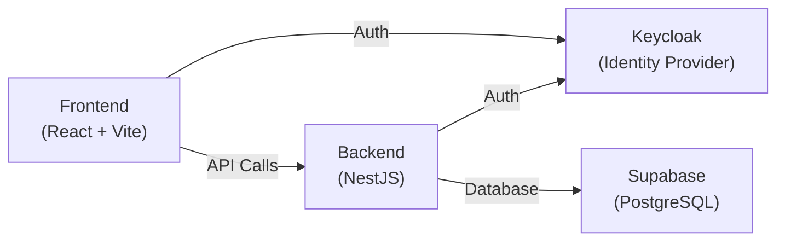

# 🚀 Deployment Guide - OneSAAS Issue Tracker

This guide explains how to deploy your full-stack application using GitLab.

---

## 📋 Deployment Architecture Overview

Your project has 4 components that need hosting:



---

## 🎯 Recommended Deployment Strategy

### Option 1: Free Tier Deployment (Recommended for Testing)

| Component | Service | Why |
|-----------|---------|-----|
| **Frontend** | Vercel/Netlify | Free, automatic deployments, CDN |
| **Backend** | Railway/Render | Free tier, Node.js support |
| **Keycloak** | Cloud Keycloak or Railway | Managed or containerized |
| **Supabase** | Supabase Cloud | Already hosted |

### Option 2: GitLab CI/CD + Docker (Production)

Deploy everything using GitLab CI/CD to:
- Docker containers on a VPS (DigitalOcean, AWS, etc.)
- Kubernetes cluster
- GitLab Container Registry

### Option 3: All-in-One VPS

Deploy all components to a single VPS using Docker Compose.

---

## 🔧 Deployment Methods

## Method 1: Frontend to Vercel (Easiest)

### Step 1: Prepare Frontend for Deployment

Create a build configuration for your frontend:

**File: `frontend/vercel.json` or `apps/frontend/vercel.json`**

```json
{
  "buildCommand": "npm run build",
  "outputDirectory": "dist",
  "framework": "vite",
  "rewrites": [
    {
      "source": "/(.*)",
      "destination": "/index.html"
    }
  ]
}
```

### Step 2: Environment Variables

Create a `.env.production` file (don't commit this):

```env
VITE_API_URL=https://your-backend-url.railway.app
VITE_KEYCLOAK_URL=https://your-keycloak-url.com
VITE_KEYCLOAK_REALM=your-realm
VITE_KEYCLOAK_CLIENT_ID=your-client-id
```

### Step 3: Deploy to Vercel

```bash
# Install Vercel CLI
npm i -g vercel

# Navigate to frontend
cd frontend  # or apps/frontend

# Deploy
vercel --prod
```

**Alternative: Connect GitLab to Vercel**
1. Go to [vercel.com](https://vercel.com)
2. Click "Import Project"
3. Select "Import from GitLab"
4. Choose your repository
5. Configure root directory (if using monorepo)
6. Set environment variables
7. Deploy!

---

## Method 2: Backend to Railway

### Step 1: Add Procfile (for Railway/Heroku)

**File: `backend-reference/Procfile`**

```
web: npm run start:prod
```

### Step 2: Ensure Production Dependencies

Update `backend-reference/package.json`:

```json
{
  "scripts": {
    "build": "nest build",
    "start:prod": "node dist/main"
  }
}
```

### Step 3: Deploy to Railway

```bash
# Install Railway CLI
npm i -g @railway/cli

# Login
railway login

# Initialize project
cd backend-reference
railway init

# Add environment variables
railway variables set JWT_SECRET=your-secret-here
railway variables set SUPABASE_URL=your-supabase-url
railway variables set SUPABASE_KEY=your-supabase-key

# Deploy
railway up
```

**Alternative: Connect GitLab to Railway**
1. Go to [railway.app](https://railway.app)
2. Click "New Project"
3. Select "Deploy from GitLab repo"
4. Choose your repository
5. Set root directory to `backend-reference`
6. Add environment variables
7. Deploy!

---

## Method 3: GitLab CI/CD Pipeline (Automated)

### Step 1: Create GitLab CI/CD Configuration

**File: `.gitlab-ci.yml`**

```yaml
stages:
  - build
  - test
  - deploy

variables:
  DOCKER_DRIVER: overlay2

# Frontend Build
build-frontend:
  stage: build
  image: node:18
  script:
    - cd apps/frontend
    - npm ci
    - npm run build
  artifacts:
    paths:
      - apps/frontend/dist
  only:
    - main

# Backend Build
build-backend:
  stage: build
  image: node:18
  script:
    - cd backend-reference
    - npm ci
    - npm run build
  artifacts:
    paths:
      - backend-reference/dist
  only:
    - main

# Deploy Frontend to GitLab Pages (Static only)
pages:
  stage: deploy
  script:
    - mkdir .public
    - cp -r apps/frontend/dist/* .public
    - mv .public public
  artifacts:
    paths:
      - public
  only:
    - main

# Deploy Backend to VPS via SSH
deploy-backend:
  stage: deploy
  image: debian:latest
  before_script:
    - apt-get update -qq && apt-get install -y -qq openssh-client rsync
    - eval $(ssh-agent -s)
    - echo "$SSH_PRIVATE_KEY" | tr -d '\r' | ssh-add -
    - mkdir -p ~/.ssh
    - chmod 700 ~/.ssh
    - ssh-keyscan $DEPLOY_SERVER >> ~/.ssh/known_hosts
  script:
    - rsync -avz --delete backend-reference/ $DEPLOY_USER@$DEPLOY_SERVER:/var/www/backend/
    - ssh $DEPLOY_USER@$DEPLOY_SERVER "cd /var/www/backend && npm ci --production && pm2 restart backend"
  only:
    - main
  when: manual
```

### Step 2: Add CI/CD Variables in GitLab

Go to **Settings → CI/CD → Variables** and add:

| Variable | Value | Protected | Masked |
|----------|-------|-----------|--------|
| `SSH_PRIVATE_KEY` | Your SSH private key | ✅ | ✅ |
| `DEPLOY_SERVER` | your-server-ip | ✅ | ❌ |
| `DEPLOY_USER` | deployment-user | ✅ | ❌ |
| `SUPABASE_URL` | https://... | ✅ | ❌ |
| `SUPABASE_KEY` | your-key | ✅ | ✅ |

---

## Method 4: Docker Deployment (Full Stack)

### Step 1: Create Dockerfiles

**File: `frontend/Dockerfile`**

```dockerfile
FROM node:18-alpine AS builder
WORKDIR /app
COPY package*.json ./
RUN npm ci
COPY . .
RUN npm run build

FROM nginx:alpine
COPY --from=builder /app/dist /usr/share/nginx/html
COPY nginx.conf /etc/nginx/conf.d/default.conf
EXPOSE 80
CMD ["nginx", "-g", "daemon off;"]
```

**File: `frontend/nginx.conf`**

```nginx
server {
    listen 80;
    server_name _;
    root /usr/share/nginx/html;
    index index.html;

    location / {
        try_files $uri $uri/ /index.html;
    }
}
```

**File: `backend-reference/Dockerfile`**

```dockerfile
FROM node:18-alpine
WORKDIR /app
COPY package*.json ./
RUN npm ci --only=production
COPY . .
RUN npm run build
EXPOSE 3001
CMD ["npm", "run", "start:prod"]
```

### Step 2: Docker Compose for Local Testing

**File: `docker-compose.yml`**

```yaml
version: '3.8'

services:
  frontend:
    build:
      context: ./frontend
      dockerfile: Dockerfile
    ports:
      - "3000:80"
    environment:
      - VITE_API_URL=http://localhost:3001
    depends_on:
      - backend

  backend:
    build:
      context: ./backend-reference
      dockerfile: Dockerfile
    ports:
      - "3001:3001"
    environment:
      - SUPABASE_URL=${SUPABASE_URL}
      - SUPABASE_KEY=${SUPABASE_KEY}
      - JWT_SECRET=${JWT_SECRET}
      - KEYCLOAK_URL=${KEYCLOAK_URL}

  keycloak:
    image: quay.io/keycloak/keycloak:latest
    ports:
      - "8080:8080"
    environment:
      - KEYCLOAK_ADMIN=admin
      - KEYCLOAK_ADMIN_PASSWORD=admin
    command: start-dev
```

### Step 3: Deploy with GitLab CI/CD

Update `.gitlab-ci.yml`:

```yaml
deploy-docker:
  stage: deploy
  image: docker:latest
  services:
    - docker:dind
  before_script:
    - docker login -u $CI_REGISTRY_USER -p $CI_REGISTRY_PASSWORD $CI_REGISTRY
  script:
    - docker build -t $CI_REGISTRY_IMAGE/frontend:$CI_COMMIT_SHORT_SHA ./frontend
    - docker build -t $CI_REGISTRY_IMAGE/backend:$CI_COMMIT_SHORT_SHA ./backend-reference
    - docker push $CI_REGISTRY_IMAGE/frontend:$CI_COMMIT_SHORT_SHA
    - docker push $CI_REGISTRY_IMAGE/backend:$CI_COMMIT_SHORT_SHA
  only:
    - main
```

---

## 🌐 Method 5: GitLab Pages (Frontend Only - Static)

> **Note**: GitLab Pages only supports static sites. Your frontend will work, but you'll need to host the backend separately.

**File: `.gitlab-ci.yml`**

```yaml
pages:
  stage: deploy
  image: node:18
  script:
    # Build frontend
    - cd apps/frontend
    - npm ci
    - npm run build
    
    # Move to public directory (required for GitLab Pages)
    - mkdir -p ../../public
    - cp -r dist/* ../../public/
  artifacts:
    paths:
      - public
  only:
    - main
```

Access your site at: `https://yourusername.gitlab.io/onesaas-issue-tracker`

---

## 📝 Environment Configuration

### Frontend Environment Variables

```env
VITE_API_URL=https://api.yourdomain.com
VITE_KEYCLOAK_URL=https://keycloak.yourdomain.com
VITE_KEYCLOAK_REALM=onesaas
VITE_KEYCLOAK_CLIENT_ID=issue-tracker-client
```

### Backend Environment Variables

```env
PORT=3001
SUPABASE_URL=https://xxxxx.supabase.co
SUPABASE_KEY=your-supabase-anon-key
JWT_SECRET=your-super-secret-jwt-key
KEYCLOAK_URL=https://keycloak.yourdomain.com
KEYCLOAK_REALM=onesaas
```

---

## 🔒 Security Checklist

Before deploying to production:

- [ ] Use environment variables for ALL secrets (never commit `.env` files)
- [ ] Enable HTTPS on all services
- [ ] Configure CORS properly in backend
- [ ] Set up Keycloak with strong admin password
- [ ] Enable Supabase Row Level Security (RLS)
- [ ] Use production builds (not dev mode)
- [ ] Set up monitoring and logging
- [ ] Configure rate limiting on API
- [ ] Enable GitLab Container Scanning
- [ ] Review and minimize exposed ports

---

## 🎯 Quick Start (Recommended Path)

For the fastest deployment:

1. **Database**: Already on Supabase ✅
2. **Backend**: Deploy to Railway
   ```bash
   cd backend-reference
   railway login
   railway init
   railway up
   ```
3. **Frontend**: Deploy to Vercel
   ```bash
   cd frontend
   vercel --prod
   ```
4. **Keycloak**: Use managed Keycloak service or deploy to Railway

Total time: ~15 minutes! 🚀

---

## 📚 Additional Resources

- [GitLab CI/CD Documentation](https://docs.gitlab.com/ee/ci/)
- [Vercel Deployment Guide](https://vercel.com/docs)
- [Railway Documentation](https://docs.railway.app)
- [Docker Documentation](https://docs.docker.com)
- [GitLab Pages Guide](https://docs.gitlab.com/ee/user/project/pages/)

---

## 🆘 Troubleshooting

### Common Issues:

**Issue**: Build fails on GitLab CI/CD
- **Solution**: Check Node.js version matches your local (use `node:18` image)

**Issue**: Environment variables not loading
- **Solution**: Ensure variables are prefixed with `VITE_` for frontend

**Issue**: CORS errors in production
- **Solution**: Update backend CORS configuration with your frontend URL

**Issue**: Keycloak redirect not working
- **Solution**: Add your production URL to Keycloak's valid redirect URIs

---

Need help? Check GitLab CI/CD logs: **CI/CD → Pipelines → [Latest Pipeline]**
