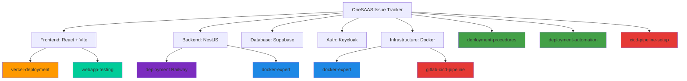

# 🎯 Installed Skills for OneSAAS Issue Tracker

This document provides an overview of all the skills that have been installed to enhance your development workflow from building to deployment.

---

## 📦 Installed Skills Summary

We've successfully installed **8 essential skills** to support your full-stack development workflow:

### 🐳 Containerization & Build Skills

#### 1. **docker-expert**
- **Source**: `sickn33/antigravity-awesome-skills@docker-expert`
- **Purpose**: Expert knowledge for Docker containerization
- **Use Cases**:
  - Dockerfile optimization and multi-stage builds
  - Container security hardening
  - Image size reduction
  - Docker Compose orchestration
  - Container networking and troubleshooting
- **Why You Need It**: Your project uses Docker extensively (docker-compose.yml with multiple services: frontend, backend, Keycloak, Supabase)
- **Location**: `.agent\skills\docker-expert\SKILL.md`

---

### 🚀 Deployment Skills

#### 2. **vercel-deployment**
- **Source**: `sickn33/antigravity-awesome-skills@vercel-deployment`
- **Purpose**: Expert guidance for deploying to Vercel with Next.js
- **Use Cases**:
  - Vercel deployment configuration
  - Environment variable management
  - Build optimization for Vercel
  - Custom domain setup
  - Preview deployments
- **Why You Need It**: Your frontend is deployed on Vercel (as mentioned in CI_CD_SETUP.md)
- **Location**: `.agent\skills\vercel-deployment\SKILL.md`

#### 3. **deployment-procedures**
- **Source**: `sickn33/antigravity-awesome-skills@deployment-procedures`
- **Purpose**: Production deployment principles and best practices
- **Use Cases**:
  - Safe deployment workflows
  - Rollback strategies
  - Verification procedures
  - Decision-making for deployments
- **Why You Need It**: Ensures safe and reliable production deployments
- **Location**: `.agent\skills\deployment-procedures\SKILL.md`

#### 4. **deployment** (Railway)
- **Source**: `railwayapp/railway-skills@deployment`
- **Purpose**: Manage Railway deployments
- **Use Cases**:
  - Railway deployment lifecycle (deploy, stop, redeploy, restart)
  - View deployment logs and status
  - Troubleshoot deployment failures
  - Monitor deployment history
- **Why You Need It**: Your CI_CD_SETUP.md mentions Railway as a deployment option
- **Location**: `.agent\skills\deployment\SKILL.md`

#### 5. **deployment-automation**
- **Source**: `aj-geddes/useful-ai-prompts@deployment-automation`
- **Purpose**: Automate deployments across environments
- **Use Cases**:
  - Helm and Terraform deployment automation
  - ArgoCD integration
  - Blue-green deployments
  - Canary releases
  - Automated rollback strategies
- **Why You Need It**: Advanced deployment automation for production workflows
- **Location**: `.agent\skills\deployment-automation\SKILL.md`

---

### 🔄 CI/CD Skills

#### 6. **gitlab-cicd-pipeline**
- **Source**: `aj-geddes/useful-ai-prompts@gitlab-cicd-pipeline`
- **Purpose**: Design and implement GitLab CI/CD pipelines
- **Use Cases**:
  - GitLab pipeline configuration
  - Stage and job definitions
  - Artifacts and caching
  - Runner configuration
  - Docker integration in CI/CD
- **Why You Need It**: Your project uses GitLab CI/CD (.gitlab-ci.yml)
- **Location**: `.agent\skills\gitlab-cicd-pipeline\SKILL.md`

#### 7. **cicd-pipeline-setup**
- **Source**: `aj-geddes/useful-ai-prompts@cicd-pipeline-setup`
- **Purpose**: General CI/CD pipeline setup with multiple platforms
- **Use Cases**:
  - GitHub Actions setup
  - GitLab CI configuration
  - Jenkins pipeline design
  - CircleCI integration
  - Automated testing and building
- **Why You Need It**: Provides foundational CI/CD knowledge across platforms
- **Location**: `.agent\skills\cicd-pipeline-setup\SKILL.md`

---

### 🧪 Testing Skills

#### 8. **webapp-testing**
- **Source**: `anthropics/skills@webapp-testing`
- **Purpose**: Comprehensive web application testing with Playwright
- **Use Cases**:
  - Frontend functionality verification
  - UI behavior debugging
  - Browser screenshot capture
  - Browser log monitoring
  - E2E testing automation
- **Why You Need It**: Testing your React + Vite frontend and verifying deployments
- **Location**: `.agent\skills\webapp-testing\SKILL.md`

---

## 🗂️ Your Project Tech Stack Mapping

Here's how the installed skills map to your project components:



---

## 📋 How to Use These Skills

### Viewing Skill Documentation
To use any skill, simply view its documentation:

```bash
# Example: View Docker expert skill
cat .agent\skills\docker-expert\SKILL.md
```

### When to Use Each Skill

| Task | Recommended Skill |
|------|------------------|
| Optimizing Dockerfiles | `docker-expert` |
| Setting up GitLab pipelines | `gitlab-cicd-pipeline`, `cicd-pipeline-setup` |
| Deploying frontend to Vercel | `vercel-deployment` |
| Managing Railway deployments | `deployment` (Railway) |
| Testing web application | `webapp-testing` |
| Planning production deployment | `deployment-procedures` |
| Automating deployments | `deployment-automation` |

---

## 🎓 Learning Path

Follow this learning path to maximize the value of these skills:

### 1. **Build Phase** (Docker)
- Start with `docker-expert` to optimize your containers
- Review your docker-compose.yml configuration
- Implement multi-stage builds for smaller images

### 2. **CI/CD Phase** (GitLab)
- Use `gitlab-cicd-pipeline` to enhance your .gitlab-ci.yml
- Implement automated testing with `webapp-testing`
- Add deployment automation with `cicd-pipeline-setup`

### 3. **Deployment Phase** (Vercel & Railway)
- Configure Vercel deployment with `vercel-deployment`
- Set up Railway backend with `deployment`
- Plan safe deployments with `deployment-procedures`

### 4. **Advanced Automation**
- Implement advanced strategies with `deployment-automation`
- Set up blue-green or canary deployments
- Automate rollback procedures

---

## 🔧 Next Steps

1. **Optimize Docker Setup**
   - Review your Dockerfiles using `docker-expert`
   - Implement best practices for security and performance

2. **Enhance CI/CD Pipeline**
   - Update .gitlab-ci.yml with recommendations from `gitlab-cicd-pipeline`
   - Add automated testing stages with `webapp-testing`

3. **Improve Deployment Process**
   - Configure proper deployment workflows using `deployment-procedures`
   - Set up monitoring and rollback strategies

4. **Test Your Application**
   - Implement E2E tests using `webapp-testing`
   - Verify deployments automatically

---

## 📚 Additional Resources

- **Skills Directory**: `f:\onesaas-issue-tracker-v.g1\.agent\skills\`
- **Search for More Skills**: `npx -y skills find <keyword>`
- **Update Skills**: `npx -y skills update`
- **Check for Updates**: `npx -y skills check`

---

## 🎯 Summary

You now have **8 specialized skills** installed that cover:

✅ **Containerization** (Docker)  
✅ **CI/CD Automation** (GitLab CI/CD, GitHub Actions)  
✅ **Deployment** (Vercel, Railway, Production)  
✅ **Testing** (Web Application Testing)  
✅ **DevOps Best Practices** (Security, Optimization, Automation)

These skills will help you throughout the entire development lifecycle:
- **Building** → docker-expert
- **Testing** → webapp-testing
- **Integration** → gitlab-cicd-pipeline, cicd-pipeline-setup
- **Deployment** → vercel-deployment, deployment (Railway), deployment-procedures
- **Automation** → deployment-automation

---

**Happy Coding! 🚀**
